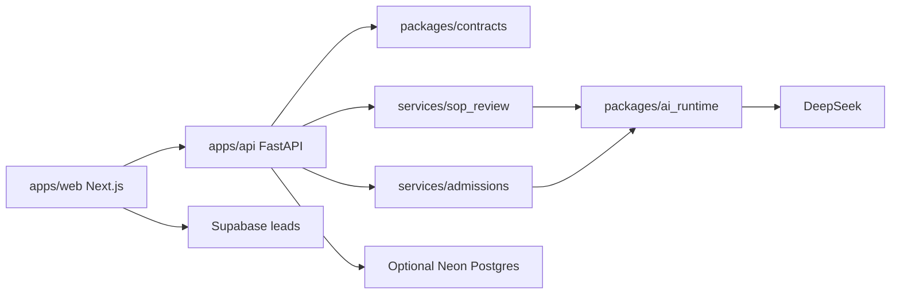

# Study Abroad Platform

Study Abroad Platform is a public monorepo for study-abroad discovery and AI-assisted applicant tools. It combines a KlassFin-themed Next.js marketing site, a FastAPI backend, reusable Python domain services, shared API contracts, and a shared AI runtime that calls DeepSeek for live AI requests.

The project is for students exploring international study options, counselors or operators who want a reference implementation for education tools, and developers evaluating how the web app, API, contracts, and prompt-heavy Python services fit together.

## What the tools do

- SOP Review: reviews a pasted Statement of Purpose against five criteria: Academic Fit, University Specificity, Career Clarity, Narrative Flow, and Language & Tone.
- Admit Predictor: estimates admissions chances for one to five target programs from an applicant profile.
- EMI Calculator: frontend-only education-loan EMI calculator.
- Resources, destinations, universities, and blog pages: code-owned public content inside the web app.
- Lead capture: browser-side Supabase inserts for consultation/resource interest. The current OTP step is a UI flow only; it does not send or verify a real OTP.

## Architecture overview



- `apps/web` is the public Next.js App Router frontend.
- `apps/api` is the public FastAPI entry point for health, live AI endpoints, deterministic mock endpoints, request guards, rate limits, safe errors, and optional Postgres persistence.
- `services/sop_review` and `services/admissions` own task-specific domain logic, prompts, schemas, validation, tests, and internal/local Streamlit adapters.
- `packages/ai_runtime` owns shared DeepSeek provider access, retries, timeout handling, JSON parsing helpers, and secret redaction.
- `packages/contracts` owns canonical Pydantic contracts, JSON Schema snapshots, frontend TypeScript types, and deterministic mock payloads.

See `docs/architecture.md` and `docs/MIGRATION_BLUEPRINT.md` for more detail.

## Monorepo structure

```text
apps/
  api/                 FastAPI backend
  web/                 Next.js frontend
docs/                  Public architecture, setup, deployment, security, and AI docs
infra/                 Placeholder for future deployment/infra assets
packages/
  ai_runtime/          Shared Python AI runtime
  contracts/           Shared API contracts and generated schemas/types
services/
  admissions/          Admissions prediction service and internal/local Streamlit adapter
  sop_review/          SOP review service and internal/local Streamlit adapter
```

## Tech stack

- Frontend: Next.js 15, React 18, TypeScript, Tailwind CSS, Framer Motion, Lucide icons, Supabase browser client.
- API: FastAPI, Pydantic, Uvicorn, Psycopg, Ruff, Mypy, Pytest.
- AI services: Python 3.11, Pydantic, Streamlit internal/local adapters, Plotly, DeepSeek via `packages/ai_runtime`.
- Tooling: `npm` for the web app, `uv` for Python packages, GitHub Actions CI for web, API, contracts, shared runtime, and both domain services.

## Local setup

Prerequisites:

- Node.js 20
- Python 3.11
- `uv`
- A DeepSeek API key for live AI calls
- Optional Supabase project values for lead capture
- Optional Neon or local Postgres database for API persistence

Install and run each package from its own directory. There is no root package manager command yet.

## Create `.env` files

Copy the committed examples and replace placeholder values:

```bash
cp apps/web/.env.example apps/web/.env
cp apps/api/.env.example apps/api/.env
cp services/sop_review/.env.example services/sop_review/.env
cp services/admissions/.env.example services/admissions/.env
```

Never commit `.env` files.

## Bring your own DeepSeek API key

Live SOP review and admissions prediction require a backend-only DeepSeek key:

```dotenv
DEEPSEEK_API_KEY=your_deepseek_api_key_here
DEEPSEEK_MODEL=deepseek-v4-flash
# DEEPSEEK_MODELS=deepseek-chat,deepseek-reasoner
# DEEPSEEK_BASE_URL=https://api.deepseek.com
```

Put these values in `apps/api/.env` for the FastAPI-backed web tools. Put the same values in `services/sop_review/.env` or `services/admissions/.env` only when running the standalone Streamlit apps.

Do not put `DEEPSEEK_API_KEY` in `apps/web/.env`; frontend variables are public in the browser. The web app only needs `NEXT_PUBLIC_STUDY_ABROAD_API_URL`.

## Run the web app

```bash
cd apps/web
npm ci
npm run dev
```

The web app runs at `http://localhost:3000`.

`apps/web/.env`:

```dotenv
NEXT_PUBLIC_SUPABASE_URL=https://your-project.supabase.co
NEXT_PUBLIC_SUPABASE_ANON_KEY=your_supabase_anon_key_here
NEXT_PUBLIC_STUDY_ABROAD_API_URL=http://localhost:8000
```

Supabase values are required for production lead capture. In local development only, the gate unlocks without writing a lead when Supabase values are omitted so mock tool flows remain testable.

## Run the API

```bash
cd apps/api
uv sync
uv run uvicorn app.main:app --reload
```

The API runs at `http://localhost:8000`.

Useful URLs:

- `GET /health`
- `POST /api/v1/sop/review`
- `POST /api/v1/sop/review/mock`
- `POST /api/v1/admissions/predict`
- `POST /api/v1/admissions/predict/mock`
- `/docs` for generated Swagger UI
- `/openapi.json` for the OpenAPI schema

Local API persistence is off in `apps/api/.env.example` with `API_PERSISTENCE_ENABLED=false` and `API_RATE_LIMIT_STORE=memory`. To test Postgres persistence, set `DATABASE_URL`, set `API_PERSISTENCE_ENABLED=true`, then run:

```bash
cd apps/api
uv run python -m app.persistence.migrations
```

## Mock and demo mode

Mock/demo mode is explicit and deterministic:

- The web app has separate demo buttons for SOP Review and Admit Predictor.
- Demo buttons call `/mock` API endpoints.
- Mock endpoints validate request shape but do not instantiate live DeepSeek providers.
- Mock calls are excluded from live AI rate limits.
- Mock and live responses share the same contract shape.

Use demo mode for local UI work, screenshots, and testing without model cost. Use live mode only after setting `DEEPSEEK_API_KEY` in the API environment.

## Run tests and checks

Configured checks:

```bash
cd apps/web
npm run test
npm run lint
npm run typecheck
npm run build

cd ../api
uv run pytest
uv run ruff format --check .
uv run ruff check .
uv run mypy app

cd ../../packages/contracts
uv run pytest

cd ../ai_runtime
uv run pytest

cd ../../services/admissions
uv run ruff format --check .
uv run ruff check .
uv run pytest
uv run python -m py_compile app.py

cd ../sop_review
uv run python -m unittest discover -s tests
uv run python -m py_compile app.py
```

GitHub Actions runs these checks across the web app, API, contracts, shared runtime, and both domain services.

No dedicated Markdown/documentation linter is configured.

## Release smoke tests

Before public release, run the automated checks above, then verify these manual flows:

```bash
cd apps/api
uv run uvicorn app.main:app --host 127.0.0.1 --port 8000
```

In another terminal:

```bash
curl http://127.0.0.1:8000/health
curl -X POST http://127.0.0.1:8000/api/v1/sop/review/mock \
  -H 'Content-Type: application/json' \
  --data '{"full_name":"Ada Lovelace","mobile":"1234567890","university":"Example University","intake":"Fall 2026","country":"UK","sop_text":"word word word word word word word word word word word word word word word word word word word word word word word word word word word word word word word word word word word word word word word word word word word word word word word word word word word word word word word word word word word word word word word word word word word word word word word word word word word word word word word word word word word word word word word word word word word word word word word word word word word word word word word word word word word word word word word word word word word word"}'
curl -X POST http://127.0.0.1:8000/api/v1/admissions/predict/mock \
  -H 'Content-Type: application/json' \
  --data '{"full_name":"Ada Lovelace","target_intake":"Fall 2026","target_country":"United Kingdom","undergrad_degree_name":"BSc Computer Science","cgpa":8.5,"cgpa_scale":10,"gre_score":320,"gmat_score":null,"english_test":"IELTS","english_score":8,"work_experience_months":12,"research_publications":1,"target_programs":["MS CS at Oxford","MS AI at Edinburgh"]}'
```

Then run the frontend against the API:

```bash
cd apps/web
NEXT_PUBLIC_STUDY_ABROAD_API_URL=http://127.0.0.1:8000 npm run dev
```

Open `http://localhost:3000/tools/sop-review` and `http://localhost:3000/tools/admit-predictor`, use demo mode for both tools, and confirm rendered results plus validation-error messages. For live DeepSeek smoke testing, set `DEEPSEEK_API_KEY` in `apps/api/.env`, restart the API, and submit one live SOP and one live admissions request. Skip live testing when no key is available or model spend/network access is intentionally disabled.

## Deployment overview

The intended production split is:

- Web: deploy `apps/web` as a Next.js app.
- API: deploy `apps/api` as a FastAPI service.
- Database: use Neon Postgres for API persistence and Postgres-backed rate limits.
- AI provider: set `DEEPSEEK_API_KEY` only on backend runtimes.
- Supabase: keep current lead-capture tables if lead capture remains in scope.

Production API settings should include:

```dotenv
DATABASE_URL=your_neon_connection_string_with_sslmode_require
API_PERSISTENCE_ENABLED=true
API_RATE_LIMIT_STORE=postgres
API_RATE_LIMIT_HASH_SALT=replace_with_random_secret
API_CORS_ORIGINS=https://your-web-origin.example
DEEPSEEK_API_KEY=your_deepseek_api_key_here
```

There is no unified production deployment pipeline yet. See `docs/deployment.md`.

## Security and privacy notes

- The public API is anonymous; there are no user accounts in the first release.
- Live AI endpoints enforce backend rate limits, JSON-only requests, request body limits, strict Pydantic validation, safe structured errors, CORS configuration, and secret-redacted logging.
- API persistence stores summarized tool records only. It does not store raw SOP text, uploaded file bytes, phone numbers, full names, raw provider output, or raw client IP addresses.
- Streamlit apps are intentionally retained as internal/local tools and use local SQLite persistence; treat their local databases as sensitive.
- `x-forwarded-for` is ignored by default. Set `API_TRUST_PROXY_HEADERS=true` only behind a trusted reverse proxy that strips untrusted forwarding headers.
- Raw user submissions must not be committed as fixtures.

See `SECURITY.md` and `docs/security-and-privacy.md`.

## Known limitations

- The frontend SOP tool accepts pasted SOP text only; upload support exists in the standalone Streamlit SOP app, not the public API flow.
- Lead-capture OTP is not real verification.
- Exact retention windows and automated deletion jobs are not implemented yet.
- No CAPTCHA, WAF, queueing layer, centralized observability, or backup/restore automation is implemented.
- End-to-end browser tests are not established.
- Static content is still code-owned rather than MDX/CMS-backed.

## Roadmap

- Add browser-level end-to-end mock-flow coverage for SOP Review and Admit Predictor.
- Define and implement exact retention/deletion windows.
- Add production deployment pipeline, observability, and backup/restore docs.
- Decide whether lead capture keeps the current gated UX, gets real OTP, or is simplified.
- Add upload support to the public SOP API only if file retention/scanning requirements are resolved.
- Move static content toward a cleaner content layer when product needs justify it.

## License

Licensed under the Apache License, Version 2.0. See [`LICENSE`](LICENSE).
