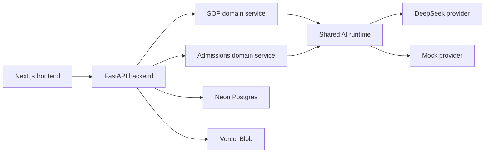

# Study Abroad Platform Monorepo Migration Blueprint

## Blueprint operating rule

This document is the authoritative migration plan for the repository.

- Future implementation prompts must treat this blueprint as the source of truth unless the user explicitly overrides it.
- After every migration prompt is completed, the implementer must review this file and update it in the same change whenever:
  - implementation reality has changed
  - a phase moved from planned to completed
  - an acceptance criterion changed status
  - a default assumption became a fixed decision
  - a new risk, constraint, or open decision emerged
- Documentation must never claim functionality that is not actually implemented.
- Supporting docs must be updated in the same change whenever implementation reality, setup commands, environment variables, architecture, deployment status, testing coverage, or feature status changes.
- If the code and this blueprint disagree, either the code must be corrected or this blueprint must be revised before continuing.

## 0. Current migration status

### Completed phases

| Phase | Status | Evidence |
|---|---|---|
| Deep audit and migration planning | Completed | Initial audit and this blueprint |
| Monorepo shell | Completed | Root workspace with `apps`, `services`, `packages`, `docs`, `infra`, and `tests` |
| Public-repo baseline docs and CI scaffold | Completed | Root docs, `.editorconfig`, `.github/workflows/ci.yml` |
| SOP service extraction | Completed | Reusable modules under `services/sop_review/sop_review` plus tests |
| Admissions service extraction | Completed | Reusable modules under `services/admissions/admissions` plus tests |
| Shared AI runtime and DeepSeek migration | Completed | `packages/ai_runtime` plus DeepSeek-backed SOP/admissions adapters and tests |
| SOP prompt quality redesign | Completed | Versioned `v2` SOP prompts, prompt metadata, synthetic eval fixtures, and regression tests |
| Admissions prompt quality redesign | Completed | Versioned `v2` admissions prompts, prompt metadata, synthetic eval fixtures, and regression tests |
| FastAPI backend public surface | Completed | `apps/api` with health, live, and deterministic mock endpoints plus API tests |
| Shared frontend/backend contracts | Completed | Canonical Pydantic API contracts, committed JSON Schemas, frontend TypeScript types, shared mock payloads, and contract docs/tests |
| Frontend framework migration | Completed | `apps/web` now runs on Next.js App Router while preserving the existing KlassFin marketing pages, mock SOP flow, and lead-capture UX |
| Frontend SOP API integration | Completed | SOP page now submits shared-contract payloads to FastAPI live and mock endpoints, renders live/mock response shapes, and keeps DeepSeek credentials behind the API boundary |
| Frontend admissions API integration | Completed | Admit Predictor is now a public Next.js tool backed by the shared admissions contracts and FastAPI live/mock endpoints |
| Public platform persistence architecture | Completed | FastAPI owns versioned Neon Postgres migrations, modular tool-specific repositories, optional Postgres-backed hashed rate-limit buckets, and env-based persistence configuration |
| Secure-by-default public AI controls | Completed | Live-only backend rate limits, JSON/body-size guards, stricter validation, safe errors, structured redacted logs, provider failure handling, frontend AI disclaimers, and security docs/tests |
| Public-facing documentation finalization | Completed | Root README plus architecture, local development, deployment, security/privacy, AI design, and evaluation docs aligned to current scripts, ports, env vars, and known limitations |

### Current repo reality after prompt fifteen

- The repo is now a monorepo rooted at:
  - `apps/web`
  - `apps/api`
  - `services/sop_review`
  - `services/admissions`
  - `packages/contracts`
  - `docs`
  - `infra`
  - `tests`
- `apps/web` is now a Next.js App Router frontend migrated from the original Vite + React app.
- `apps/api` now exposes the first public FastAPI surface for SOP review and admissions prediction, with CORS configuration, JSON-only request guards, body-size limits, safe structured errors, structured redacted request/error logs, backend live AI rate limits, and safe provider-failure responses.
- `services/sop_review` now contains reusable service modules plus a temporary Streamlit adapter.
- `services/admissions` now contains reusable service modules plus a temporary Streamlit adapter.
- `packages/ai_runtime` now owns shared provider clients, retries, timeout handling, response normalization, JSON parsing helpers, and secret redaction.
- `packages/contracts` now owns canonical API request/response models, committed JSON Schema snapshots, frontend TypeScript contract types, shared mock payloads, and contract drift tests.
- Both Python services use DeepSeek through thin task-specific adapters over the shared AI runtime.
- Both Python services now expose provider protocols so domain orchestration is no longer inherently tied to Streamlit.
- Prompt organization is now normalized across both Python services:
  - SOP: active `services/sop_review/sop_review/prompts/v2.py` with historical `v1.py` retained
  - Admissions: active `services/admissions/admissions/prompts/v2.py` with historical `v1.py` retained
- SOP prompt evaluation now has sanitized synthetic fixtures and regression checks for schema validity, rubric order, concise outputs, and broad quality calibration.
- Admissions prompt evaluation now has sanitized synthetic fixtures and regression checks for schema validity, concise grounded reasoning, and broad category calibration across strong, borderline, weak, and unrealistic-target profiles.
- Automated tests now exist for both Python services.
- Frontend SOP review and Admit Predictor now have API client layers for live and deterministic mock submissions using the shared TypeScript contracts.
- Frontend SOP live mode sends applicant details and pasted SOP text to `POST /api/v1/sop/review`; demo mode calls `POST /api/v1/sop/review/mock` and labels the result as demo output.
- Frontend SOP review and Admit Predictor pages now disclose that AI outputs are informational and require human judgment; admissions estimates are not guarantees.
- Frontend linting, type-checking, tests, and Next.js build verification are part of the SOP integration verification.
- The SOP page renders the same five rubric criteria as the backend grading schema.
- The Admit Predictor page renders admissions target predictions, chance categories, probabilities, reasoning, strengths, weaknesses, roadmap items, and recommended universities from the backend response schema.
- `apps/api` now has a production persistence architecture targeting Neon Postgres:
  - versioned SQL migrations in `apps/api/migrations`
  - a migration runner at `python -m app.persistence.migrations`
  - separate SOP review and admissions repositories
  - optional Postgres-backed live AI rate-limit buckets
  - environment-variable configuration documented in `apps/api/.env.example`
- First-release SOP API persistence intentionally does not store raw SOP text, uploaded file bytes, phone numbers, or full names.
- Original SOP uploads are treated as transient processing input for the first public API release. Vercel Blob remains the target only if file retention becomes a product requirement.
- API rate-limit persistence stores salted hashes of anonymous identifiers rather than raw IP addresses.
- API client identity ignores `x-forwarded-for` by default to avoid trusting spoofable public headers; `API_TRUST_PROXY_HEADERS=true` is only for trusted reverse-proxy deployments.
- Mock endpoints remain separate from live endpoints and do not instantiate live model providers.
- Public documentation now describes the current monorepo, BYO DeepSeek workflow,
  mock/demo mode, local setup, deployment posture, security/privacy posture,
  known limitations, and roadmap.
- Current GitHub Actions CI covers the web app, admissions Streamlit service, and
  SOP review Streamlit service. API, contract, and shared runtime checks are
  documented but not yet wired into CI.

## 1. Current-state summary

### Repositories inspected

#### `ai-sop-review-grader`
- `README.md`
- `RUNBOOK.md`
- `pyproject.toml`
- `.env.example`
- `.gitignore`
- `Dockerfile`
- `app.py`
- `data/universities.json`

#### `graduate-admissions-predictor`
- `README.md`
- `RUNBOOK.md`
- `pyproject.toml`
- `.env.example`
- `.gitignore`
- `app.py`

#### `klassfin-bolt`
- `README.md`
- `package.json`
- `tailwind.config.js`
- `src/App.tsx`
- `src/main.tsx`
- `src/index.css`
- `src/components/layout/Layout.tsx`
- `src/components/layout/Navbar.tsx`
- `src/components/layout/Footer.tsx`
- `src/components/ToolLeadGate.tsx`
- `src/components/LeadModal.tsx`
- `src/components/ResourceLeadModal.tsx`
- `src/context/ModalContext.tsx`
- `src/lib/supabase.ts`
- `src/pages/HomePage.tsx`
- `src/pages/ToolsPage.tsx`
- `src/pages/SOPReviewPage.tsx`
- `src/pages/EMICalculatorPage.tsx`
- `src/pages/ResourcesPage.tsx`
- `src/data/countries.ts`
- `src/data/universities.ts`
- `src/data/blog.ts`
- `supabase/migrations/20260214163103_create_tool_leads_table.sql`
- `supabase/migrations/20260214163845_add_target_intake_to_tool_leads.sql`
- `supabase/migrations/20260214170543_add_target_course_to_tool_leads.sql`

### Historical material inspected
- Git history in all three original repos
- Deleted-file history checks in all three original repos
- Historical deleted docs were recoverable from Git history for the two Python tools and were used only as context, not as truth where they diverged from current code.

### What is implemented today

| Area | Implemented today |
|---|---|
| SOP review | Streamlit app; paste/upload support; PDF/DOCX/TXT extraction; word-count gate; DeepSeek validity check; DeepSeek grading; strict Pydantic parsing; SQLite persistence; per-session rate limiting; rotating logs; model fallback |
| Admit prediction | Streamlit app; full profile form; DeepSeek prompt; strict nested schema; JSON repair pass; SQLite persistence; validation; result charts |
| Frontend | Next.js marketing site with preserved KlassFin theme, static content, EMI calculator, resources, lead capture, and API-backed live/mock SOP review plus Admit Predictor pages |
| Lead capture | Supabase-backed inserts into `tool_leads`; UI flows for phone, fake OTP step, and details capture |
| Data | Local SQLite for both Python apps; Supabase/Postgres only for frontend lead capture |

### What is only implied by docs or missing

| Area | Missing / only implied |
|---|---|
| Backend architecture | FastAPI backend exists for the first public release surface; persistence hardening and production deployment work remain |
| AI provider | DeepSeek is active through `packages/ai_runtime`; service-level provider protocols remain in place |
| Frontend integration | SOP review and Admit Predictor are API-backed public tools; broader frontend content restructuring remains pending |
| Mocking | SOP review and Admit Predictor frontend flows call their backend mock endpoints |
| Production data | Neon Postgres migrations and API persistence layer exist; automated retention jobs and production deployment wiring remain pending |
| File persistence | No blob storage implementation; first-release API design intentionally processes SOP uploads/text transiently instead of retaining originals |
| Security / hygiene | Public-repo baseline docs, CI, data-minimized API persistence, public API request guards, live-only rate limits, safe errors, structured redacted logs, and privacy notes exist; exact retention windows and automated deletion remain pending |

### Current frontend/backend contradictions

- Frontend and backend SOP rubric names are now aligned on:
  - `Academic Fit`
  - `University Specificity`
  - `Career Clarity`
  - `Narrative Flow`
  - `Language & Tone`
- Frontend SOP now accepts pasted text and applicant details, then lets the backend enforce the 100–2500 word scoring gate; frontend upload support is still pending.
- Frontend Tools page now links Admit Predictor as a first-class public tool.
- Lead flows present an OTP step, but no OTP is actually sent or verified.
- Frontend reads the public API base URL from `NEXT_PUBLIC_STUDY_ABROAD_API_URL`; DeepSeek credentials remain backend-only.

## 2. Recommended target monorepo architecture

### Target shape

- `apps/web`: Next.js public frontend preserving the current KlassFin visual theme
- `apps/api`: FastAPI backend
- `services/sop_review` and `services/admissions`: separate reusable Python domain services for SOP review and admit prediction
- `packages/ai_runtime`: shared Python AI runtime for provider clients, retries, parsing/repair, logging, and redaction
- `packages/contracts`: shared API contracts, examples, generated client types
- `docs`: public-repo-grade documentation



### Architectural principles

- Provider-specific code must not enter core domain service logic.
- SOP review and admissions prediction remain separate task-specific domain modules even when they share AI infrastructure.
- One shared AI runtime owns cross-cutting LLM concerns: provider clients, retries, timeout handling, response normalization, JSON parsing/repair, logging, and redaction.
- Frontend code must consume explicit contracts rather than ad hoc payloads.
- Mock/demo responses and live responses must share the same schema.
- No visual redesign is allowed during framework migration unless explicitly approved.
- Public docs must describe shipped behavior honestly.
- Every behavior change must ship with appropriate verification.
- Public-repo hygiene is non-negotiable: no secrets, no local DBs, no raw user documents, no personal absolute paths, no runtime logs.
- Prompt assets must be versioned and evaluated deliberately rather than edited in place without traceability.

### Fixed decisions

- Public monorepo
- Next.js frontend target
- FastAPI backend target
- Preserve the current KlassFin theme
- DeepSeek replaces Gemini in the production execution path
- Reusable SOP and admissions domain services
- Shared AI runtime plus separate task-specific modules for SOP review and admissions prediction
- No user accounts/sign-in for the first public release
- User-visible mock/demo mode for both AI tools
- Public-repo-grade documentation and CI are part of the product, not optional polish
- Neon Postgres is the production relational database target for API persistence
- First-release API persistence stores summarized tool records only; raw SOP text and original uploads are transient processing inputs
- Vercel Blob is deferred until there is a product requirement to retain original SOP uploads

### Default assumptions to re-evaluate as implementation proceeds

- Neon Postgres is the production database target.
- Vercel Blob is the preferred storage target if original SOP uploads are persisted.
- Static content remains code-owned for now but should stay migration-friendly.
- Lead capture remains part of the product, but the current fake OTP UX must either become real or be simplified honestly.
- API persistence defaults to off for local development when `DATABASE_URL` is absent.
- Production live AI rate limiting should use Postgres buckets with salted identifier hashes.
- Data-retention defaults favor minimization unless a clear product need justifies longer storage.

### Open decisions that should be resolved before their dependent phases

- Final numeric retention windows for summarized SOP review records, admissions prediction records, and rate-limit buckets.
- Whether future uploaded SOP file retention is needed after first release; if yes, use Vercel Blob and store only references/metadata in Postgres.
- Whether lead capture should remain gated ahead of tools or be simplified for the first public release.

### Architectural decisions already fixed for the current target

- FastAPI is the only public backend entry point.
- SOP and admissions logic move into reusable domain services.
- DeepSeek replaces Gemini in the production path.
- AI access flows through one shared AI runtime:
  - provider clients such as `DeepSeekProvider`
  - deterministic `MockProvider` implementations
  - shared retries, timeout handling, response normalization, JSON parsing/repair, logging, and redaction
- SOP review and admissions prediction remain separate domain modules that plug into the shared runtime.
- Frontend supports both:
  - user-visible mock/demo mode
- Mock/demo calls are supported for both SOP review and admit prediction.
- Real AI calls are rate-limited server-side under the current anonymous
  client-identifier policy. By default the API ignores spoofable
  `x-forwarded-for`; trusted proxy headers are opt-in.
- Mock/demo calls are excluded from live-model quotas.
- No user accounts or sign-in.
- Production API persistence uses separate SOP review, admissions prediction, and rate-limit tables rather than a shared tool-submission model.
- Postgres-backed rate limiting stores salted hashes of anonymous client identifiers.
- Production database target is Neon Postgres.
- Static content remains code-owned for now, but should be structured so it can later move cleanly into a content layer such as MDX or a CMS.

## 3. Proposed folder tree

```text
study-abroad-platform/
├── apps/
│   ├── web/
│   │   ├── app/
│   │   │   ├── (marketing)/
│   │   │   ├── tools/
│   │   │   │   ├── sop-review/
│   │   │   │   └── admit-predictor/
│   │   │   └── api-health/
│   │   ├── components/
│   │   ├── features/
│   │   │   ├── sop-review/
│   │   │   └── admit-predictor/
│   │   ├── content/
│   │   │   ├── blog/
│   │   │   ├── countries/
│   │   │   └── universities/
│   │   ├── lib/
│   │   │   ├── api-client/
│   │   │   └── mode/
│   │   ├── public/
│   │   ├── styles/
│   │   ├── tests/
│   │   └── package.json
│   └── api/
│       ├── app/
│       │   ├── main.py
│       │   ├── api/
│       │   │   ├── routes/
│       │   │   │   ├── health.py
│       │   │   │   ├── sop.py
│       │   │   │   └── admissions.py
│       │   │   └── deps.py
│       │   ├── core/
│       │   │   ├── config.py
│       │   │   ├── rate_limits.py
│       │   │   └── security.py
│       │   ├── persistence/
│       │   │   ├── models.py
│       │   │   ├── repositories.py
│       │   │   └── retention.py
│       │   ├── storage/
│       │   │   └── blob_store.py
│       │   └── providers/
│       │       ├── ai_base.py
│       │       ├── deepseek.py
│       │       └── mock.py
│       ├── alembic/
│       ├── tests/
│       └── pyproject.toml
├── packages/
│   ├── ai_runtime/
│   │   ├── providers/
│   │   ├── parsing.py
│   │   ├── retry.py
│   │   └── redaction.py
│   └── contracts/
│       ├── openapi/
│       ├── examples/
│       └── generated/
├── services/
│   ├── sop_review/
│   │   ├── sop_review/
│   │   │   ├── service.py
│   │   │   ├── prompts/
│   │   │   ├── schemas.py
│   │   │   └── validation.py
│   │   └── tests/
│   └── admissions/
│       ├── admissions/
│       │   ├── service.py
│       │   ├── prompts/
│       │   ├── schemas.py
│       │   └── validation.py
│       └── tests/
├── docs/
│   ├── architecture.md
│   ├── api.md
│   ├── deployment.md
│   ├── security.md
│   ├── local-development.md
│   └── data-retention.md
├── infra/
│   ├── env/
│   └── deployment/
├── .github/
│   └── workflows/
│       ├── ci.yml
│       └── deploy-checks.yml
├── README.md
├── CONTRIBUTING.md
├── SECURITY.md
├── LICENSE
├── pyproject.toml
├── package.json
└── pnpm-workspace.yaml
```

## 4. Phased migration plan

### MVP phases

#### Phase 0 — Freeze contracts and preserve design
- Inventory current routes, theme tokens, UI primitives, and content sections.
- Define canonical API contracts for:
  - SOP review
  - admit prediction
  - mock/demo execution
  - error envelopes
- Fix persistence policy:
  - original SOP uploads persisted
  - SOP outputs retained `1 year`
  - admit-prediction records retained `1 year`
  - scheduled deletion after retention expiry
- Confirm lead capture remains in product scope.

#### Phase 1 — Create monorepo skeleton
- Add root workspace tooling.
- Establish `apps`, `packages`, `docs`, and `.github/workflows`.
- Add root CI commands and shared development conventions.
- Add public repo baseline files:
  - `README.md`
  - `CONTRIBUTING.md`
  - `SECURITY.md`
  - `LICENSE` (`Apache-2.0`)

#### Phase 2 — Extract backend domain services
- Move SOP business logic out of Streamlit into `services/sop_review/sop_review`.
- Move admissions logic into `services/admissions/admissions`.
- Preserve:
  - SOP prompts
  - admissions prompts
  - validation rules
  - parser schemas
  - admissions post-processing and repair behavior
  - university catalog behavior
- Remove Gemini-specific assumptions from domain code.
- Normalize prompt modules under `prompts/v1.py` before provider migration.

#### Phase 3 — Build FastAPI backend

Status: Completed for the first public API surface, persistence architecture, and first-pass public hardening. Production deployment, retention automation, and stronger bot mitigation remain follow-up work.
- Implement:
  - `GET /health`
  - `POST /api/v1/sop/review`
  - `POST /api/v1/sop/review/mock`
  - `POST /api/v1/admissions/predict`
  - `POST /api/v1/admissions/predict/mock`
- Add:
  - provider selection
  - request IDs
  - structured errors
  - server-side validation
  - real-call rate limiting
  - logging and redaction
- Add persistence:
  - Neon Postgres
  - migrations
  - Vercel Blob-backed original SOP uploads only if future product requirements need file retention
  - retention/deletion behavior once the final retention decision is fixed

#### Phase 4 — Introduce the shared AI runtime and replace Gemini with DeepSeek

Status: Completed.
- Add `packages/ai_runtime` as the single home for provider clients, retries, timeout handling, response normalization, JSON parsing/repair, logging, and redaction.
- Implement `DeepSeekProvider` in the shared runtime.
- Keep SOP review and admissions prediction as separate task modules that plug into the shared runtime.
- Preserve prompt intent first; optimize only after parity is proven.
- Add deterministic mock-provider support for both tools through the same runtime boundary.
- Verify:
  - valid JSON responses
  - malformed JSON handling
  - retries
  - timeout behavior
  - repair pass behavior

#### Phase 5 — Rebuild frontend in Next.js

Status: In progress; SOP and admissions frontend API integrations are completed,
while content restructuring remains pending.
- Completed in the framework-migration slice:
  - Port the current KlassFin pages and theme faithfully.
  - Preserve current public routes, static assets, mock SOP behavior, and lead-capture UX.
- Still pending in later product-integration work:
  - Port static content into a cleaner code-owned content structure that can later move to MDX/CMS.
- Completed in previous integration slices:
  - Replace the mock-only SOP page with an API-backed SOP feature.
  - Add the public Admit Predictor page.
  - Expose real AI mode and user-visible demo/mock mode.
- Keep lead capture in the UX without turning it into account creation.

#### Phase 6 — Production hardening

Status: Partially completed. Public request guards, CORS configuration, safe
errors, redacted structured logs, live-only backend rate limits, provider failure
handling, JSON/body-size limits, and frontend AI disclaimers are implemented.
Follow-up work remains for stronger bot mitigation, retention deletion jobs,
backup/restore docs, and any future upload-scanning strategy if API uploads are
added.
- Completed:
  - enforce the anonymous live-request rate-limit policy across SOP + admissions
  - exclude mock/demo calls from quotas
  - CORS policy
  - request validation
  - secret handling
  - safe error responses
  - health checks
- Still pending:
  - upload scanning/validation strategy if uploaded SOP files become part of the public API
  - centralized observability beyond structured application logs
  - backup/restore docs
  - retention deletion verification

#### Phase 7 — Public release readiness
Status: Partially completed. Public-facing documentation has been finalized for
current implementation reality. Screenshots/demo instructions, CI coverage for
API/contracts/shared runtime, production release operations, and end-to-end
verification remain pending.
- Finalize docs.
- Add screenshots/demo instructions.
- Verify deployment paths.
- Ensure a fresh engineer can clone, configure, run, test, and deploy without guessing.

### Later enhancements, not MVP

- Async background jobs for long-running AI work
- Streaming responses
- User history or dashboards
- Admin moderation tooling
- Multi-provider failover
- Richer rubric customization
- Human review workflows
- Analytics stack beyond baseline operational metrics

## 5. Technical risks and decisions

| Topic | Risk / decision |
|---|---|
| DeepSeek migration | Legacy prompts and parsing were tuned around Gemini behavior; DeepSeek parity must be validated, not assumed. |
| Shared AI runtime | SOP and admissions now expose compatible provider boundaries, but shared runtime behavior still needs to be centralized deliberately rather than duplicated across services. |
| Upload retention | Persisting original SOP files introduces privacy, storage, deletion, and access-control obligations. |
| Rate limiting | API live endpoints now support Postgres-backed hashed buckets for production; in-memory limits remain local/single-process only. |
| Device identity | “Per device” without sign-in needs a practical anonymous identifier strategy; it should not rely only on frontend state. |
| Lead capture | Existing OTP UX is not real verification. Retaining lead capture requires deciding whether OTP becomes real or whether the flow is simplified honestly. |
| Contract drift | Shared contracts now prevent the earlier frontend/backend rubric and payload drift; keep schema diffs reviewable whenever payloads change. |
| Testing gap | Service-level, API, contract, and frontend build/type/lint checks now exist, but end-to-end coverage is still pending. |
| Data model consolidation | SOP, admissions, and leads currently live in different storage models and need a unified schema strategy. |
| Public repo readiness | Public-facing docs now cover setup, architecture, deployment, security/privacy, AI design, evaluations, BYO DeepSeek, mock/demo mode, limitations, and roadmap. Docs must still keep evolving with implementation. |
| Static content | Content remains code-owned now, so structure it cleanly enough to extract later without rewriting page logic. |

## 6. KlassFin frontend theme preservation checklist

- Preserve the `brand`, `accent`, `gold`, and `lavender` palettes.
- Preserve `Poppins` typography and current hierarchy.
- Preserve button styles:
  - primary
  - secondary
  - outline
- Preserve:
  - rounded cards
  - soft borders
  - subtle shadows
  - section spacing
  - max-width container rhythm
- Preserve hero treatment:
  - deep purple gradients
  - soft blurred background glows
  - white-on-brand headers
- Preserve navbar behavior:
  - transparent over hero
  - white/scrolled state
  - mobile menu behavior
- Preserve footer structure and brand voice.
- Preserve visual patterns:
  - icon-led cards
  - badges
  - stat strip
  - FAQ section
  - testimonials
  - partner logos
  - subtle entrance animation
- Preserve EMI calculator interaction model and visual design.
- Preserve the overall product feel: premium, calm, conversion-oriented, and recognizably KlassFin.

## 7. Acceptance criteria for the complete migration

### Architecture
- One public monorepo exists with web, API, reusable services, shared contracts, docs, and CI.
- SOP and admit prediction are reusable domain services.
- FastAPI is the only public backend contract.

### Frontend
- Next.js frontend preserves the current KlassFin theme.
- Existing public marketing routes are preserved or intentionally redirected.
- SOP review is real, API-backed, and supports uploaded files.
- Admit Predictor is available in the frontend.
- Real and mock/demo AI modes both work.

### AI
- Gemini is removed from the production execution path.
- DeepSeek powers real AI requests.
- Mock provider exists for both SOP review and admit prediction.
- Mock/demo mode is available both visibly to users and through environment configuration.

### Data
- Neon Postgres is the production database target.
- If original SOP uploads are persisted, their storage lifecycle is explicit and safe.
- Retention policy is explicit, documented, and implemented.
- Migrations are versioned and reproducible.

### Security and abuse controls
- No user accounts or sign-in are required.
- Lead capture behavior is explicit and honest.
- Real AI requests are rate-limited server-side under a documented anonymous policy.
- Mock/demo requests are excluded from rate limits.
- Input validation, file validation, CORS, safe error handling, and secret redaction are present.
- Public repo contains no secrets.

### Testing
- Backend tests cover:
  - validation
  - parsing
  - shared AI runtime behavior
  - provider wiring
  - error handling
  - post-processing
  - routes
- Frontend tests cover:
  - SOP flow
  - admit predictor flow
  - real/mock switching
- Integration tests cover API contracts.
- Target CI runs linting, type checking, tests, and builds across the monorepo.

### Documentation
- Root README explains architecture, setup, environment variables, and deployment.
- Public docs cover:
  - local development
  - API usage
  - security
  - retention
  - deployment
- `Apache-2.0` license is present.
- Contradictory proprietary/confidential wording is removed.

### Deployment readiness
- Web and API deployment paths are documented.
- Environment variable matrix exists for local, demo, and production.
- Health checks and operational runbooks exist.
- A fresh engineer can clone, configure, run, test, and deploy without guessing.

## Final decision log

### Verified
- Current repo structure
- Existing docs and configs
- SOP implementation
- Admit predictor implementation
- Prompt strings and schemas
- Current KlassFin frontend theme
- Existing Supabase lead capture schema
- Git history and absence of recoverable deleted docs
- Presence of baseline CI
- Presence of SOP and admissions service tests
- Prompt layout normalization across both services
- Public README and supporting docs matched against current scripts, ports,
  environment variables, API routes, and CI configuration

### Not verified
- Runtime behavior of the apps
- Deployed environments
- Supabase live data or policies beyond local migration files
- Performance, accessibility, and browser rendering
- Live DeepSeek calls
- End-to-end browser flows

### Fixed decisions
- Public monorepo
- Next.js frontend
- FastAPI backend
- Preserve KlassFin theme
- DeepSeek instead of Gemini
- Reusable SOP and admissions domain services
- Shared AI runtime plus separate task-specific modules for SOP review and admissions prediction
- No user accounts/sign-in
- Mock mode is user-visible for the public tools
- Public docs and CI are required parts of the product
- First public API release processes SOP text transiently and does not persist
  original SOP uploads

### Open decisions
- Final retention policy
- Final lead-capture behavior for the public tools
- Whether future SOP upload retention is needed after the pasted-text public API
  flow
