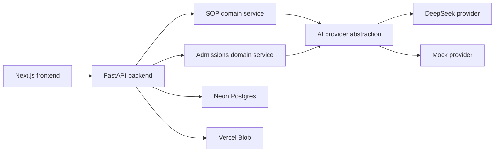

# Study Abroad Platform Monorepo Migration Blueprint

## 1. Current-state summary

### Repositories inspected

#### `ai-sop-review-grader`
- `README.md`
- `RUNBOOK.md`
- `pyproject.toml`
- `.env.example`
- `.gitignore`
- `Dockerfile`
- `app.py`
- `data/universities.json`

#### `graduate-admissions-predictor`
- `README.md`
- `RUNBOOK.md`
- `pyproject.toml`
- `.env.example`
- `.gitignore`
- `app.py`

#### `klassfin-bolt`
- `README.md`
- `package.json`
- `tailwind.config.js`
- `src/App.tsx`
- `src/main.tsx`
- `src/index.css`
- `src/components/layout/Layout.tsx`
- `src/components/layout/Navbar.tsx`
- `src/components/layout/Footer.tsx`
- `src/components/ToolLeadGate.tsx`
- `src/components/LeadModal.tsx`
- `src/components/ResourceLeadModal.tsx`
- `src/context/ModalContext.tsx`
- `src/lib/supabase.ts`
- `src/pages/HomePage.tsx`
- `src/pages/ToolsPage.tsx`
- `src/pages/SOPReviewPage.tsx`
- `src/pages/EMICalculatorPage.tsx`
- `src/pages/ResourcesPage.tsx`
- `src/data/countries.ts`
- `src/data/universities.ts`
- `src/data/blog.ts`
- `supabase/migrations/20260214163103_create_tool_leads_table.sql`
- `supabase/migrations/20260214163845_add_target_intake_to_tool_leads.sql`
- `supabase/migrations/20260214170543_add_target_course_to_tool_leads.sql`

### Historical material inspected
- Git history in all three repos
- Deleted-file history checks in all three repos
- No deleted historical docs were available to recover; each repo has very short history.

### What is implemented today

| Area | Implemented today |
|---|---|
| SOP review | Streamlit app; paste/upload support; PDF/DOCX/TXT extraction; word-count gate; Gemini validity check; Gemini grading; strict Pydantic parsing; SQLite persistence; per-session rate limiting; rotating logs; model fallback |
| Admit prediction | Streamlit app; full profile form; Gemini prompt; strict nested schema; JSON repair pass; SQLite persistence; validation; result charts |
| Frontend | Vite + React marketing site with strong KlassFin theme, static content, EMI calculator, resources, lead capture, mock SOP page |
| Lead capture | Supabase-backed inserts into `tool_leads`; UI flows for phone, fake OTP step, and details capture |
| Data | Local SQLite for both Python apps; Supabase/Postgres only for frontend lead capture |

### What is only implied by docs or missing

| Area | Missing / only implied |
|---|---|
| Backend architecture | No FastAPI backend, no reusable domain packages, no public API contract |
| AI provider | No DeepSeek support, no provider abstraction |
| Frontend integration | No real AI-backed SOP page, no admit predictor page, no frontend API client layer |
| Mocking | Mock SOP exists only as hard-coded frontend behavior; no unified mock mode for both tools |
| Production data | No Neon Postgres path, no shared schema, no centralized migrations |
| File persistence | No blob storage implementation |
| Security / hygiene | No public-repo-grade docs, no CI, no tests, no security policy, no explicit retention policy |

### Current frontend/backend contradictions

- Frontend SOP page is mock-only; backend SOP app is real.
- Frontend SOP rubric:
  - `Grammar & Clarity`
  - `Structure & Flow`
  - `Impact & Persuasion`
  - `Relevance to Program`
- Backend SOP rubric:
  - `Academic Fit`
  - `University Specificity`
  - `Career Clarity`
  - `Narrative Flow`
  - `Language & Tone`
- Frontend SOP accepts pasted text only with a 50-character minimum; backend accepts paste or upload and enforces 100–2500 words.
- Frontend SOP collects no applicant details before analysis; backend requires `full_name`, `mobile`, `university`, `intake`, and `country`.
- Frontend Tools page marks Admit Predictor as “Coming Soon”; a working predictor already exists separately.
- Lead flows present an OTP step, but no OTP is actually sent or verified.
- Frontend README describes an SOP review service and Supabase backend, but the SOP tool is not API-backed today.

## 2. Recommended target monorepo architecture

### Target shape

- `apps/web`: Next.js public frontend preserving the current KlassFin visual theme
- `apps/api`: FastAPI backend
- `packages/domain`: reusable Python domain services for SOP review and admit prediction
- `packages/contracts`: shared API contracts, examples, generated client types
- `packages/ui`: reusable theme primitives and shared UI pieces
- `docs`: public-repo-grade documentation



### Architectural decisions

- FastAPI is the only public backend entry point.
- SOP and admissions logic move into reusable domain services.
- DeepSeek replaces Gemini in the production path.
- AI access goes through a provider abstraction:
  - `DeepSeekProvider`
  - `MockProvider`
- Frontend supports both:
  - user-visible mock/demo mode
  - environment-controlled mock/demo mode
- Mock/demo calls are supported for both SOP review and admit prediction.
- Real AI calls are rate-limited to `3` per device per day across both tools combined.
- Mock/demo calls are excluded from rate limits.
- No user accounts or sign-in.
- Lead capture remains part of the product.
- Original SOP uploads are persisted.
- Production database target is Neon Postgres.
- Original SOP files are stored in Vercel Blob.
- SOP uploads, SOP AI outputs, and admit-prediction records are retained for `1 year`, then deleted.
- Static content remains code-owned for now, but should be structured so it can later move cleanly into a content layer such as MDX or a CMS.
- Public repo license: `Apache-2.0`.

## 3. Proposed folder tree

```text
study-abroad-platform/
├── apps/
│   ├── web/
│   │   ├── app/
│   │   │   ├── (marketing)/
│   │   │   ├── tools/
│   │   │   │   ├── sop-review/
│   │   │   │   └── admit-predictor/
│   │   │   └── api-health/
│   │   ├── components/
│   │   ├── features/
│   │   │   ├── sop-review/
│   │   │   └── admit-predictor/
│   │   ├── content/
│   │   │   ├── blog/
│   │   │   ├── countries/
│   │   │   └── universities/
│   │   ├── lib/
│   │   │   ├── api-client/
│   │   │   └── mode/
│   │   ├── public/
│   │   ├── styles/
│   │   ├── tests/
│   │   └── package.json
│   └── api/
│       ├── app/
│       │   ├── main.py
│       │   ├── api/
│       │   │   ├── routes/
│       │   │   │   ├── health.py
│       │   │   │   ├── sop.py
│       │   │   │   └── admissions.py
│       │   │   └── deps.py
│       │   ├── core/
│       │   │   ├── config.py
│       │   │   ├── rate_limits.py
│       │   │   └── security.py
│       │   ├── persistence/
│       │   │   ├── models.py
│       │   │   ├── repositories.py
│       │   │   └── retention.py
│       │   ├── storage/
│       │   │   └── blob_store.py
│       │   └── providers/
│       │       ├── ai_base.py
│       │       ├── deepseek.py
│       │       └── mock.py
│       ├── alembic/
│       ├── tests/
│       └── pyproject.toml
├── packages/
│   ├── domain/
│   │   ├── sop/
│   │   │   ├── service.py
│   │   │   ├── prompts.py
│   │   │   ├── schemas.py
│   │   │   └── parsing.py
│   │   └── admissions/
│   │       ├── service.py
│   │       ├── prompts.py
│   │       ├── schemas.py
│   │       └── postprocess.py
│   ├── contracts/
│   │   ├── openapi/
│   │   ├── examples/
│   │   └── generated/
│   └── ui/
│       ├── tokens/
│       ├── components/
│       └── theme/
├── docs/
│   ├── architecture.md
│   ├── api.md
│   ├── deployment.md
│   ├── security.md
│   ├── local-development.md
│   └── data-retention.md
├── infra/
│   ├── env/
│   └── deployment/
├── .github/
│   └── workflows/
│       ├── ci.yml
│       └── deploy-checks.yml
├── README.md
├── CONTRIBUTING.md
├── SECURITY.md
├── LICENSE
├── pyproject.toml
├── package.json
└── pnpm-workspace.yaml
```

## 4. Phased migration plan

### MVP phases

#### Phase 0 — Freeze contracts and preserve design
- Inventory current routes, theme tokens, UI primitives, and content sections.
- Define canonical API contracts for:
  - SOP review
  - admit prediction
  - mock/demo execution
  - error envelopes
- Fix persistence policy:
  - original SOP uploads persisted
  - SOP outputs retained `1 year`
  - admit-prediction records retained `1 year`
  - scheduled deletion after retention expiry
- Confirm lead capture remains in product scope.

#### Phase 1 — Create monorepo skeleton
- Add root workspace tooling.
- Establish `apps`, `packages`, `docs`, and `.github/workflows`.
- Add root CI commands and shared development conventions.
- Add public repo baseline files:
  - `README.md`
  - `CONTRIBUTING.md`
  - `SECURITY.md`
  - `LICENSE` (`Apache-2.0`)

#### Phase 2 — Extract backend domain services
- Move SOP business logic out of Streamlit into `packages/domain/sop`.
- Move admissions logic into `packages/domain/admissions`.
- Preserve:
  - SOP prompts
  - admissions prompts
  - validation rules
  - parser schemas
  - admissions post-processing and repair behavior
  - university catalog behavior
- Remove Gemini-specific assumptions from domain code.

#### Phase 3 — Build FastAPI backend
- Implement:
  - `/healthz`
  - `/v1/sop/reviews`
  - `/v1/admissions/predictions`
- Add:
  - provider selection
  - request IDs
  - structured errors
  - server-side validation
  - real-call rate limiting
  - logging and redaction
- Add persistence:
  - Neon Postgres
  - migrations
  - Vercel Blob-backed original SOP uploads
  - retention/deletion jobs

#### Phase 4 — Replace Gemini with DeepSeek
- Implement `DeepSeekProvider`.
- Preserve prompt intent first; optimize only after parity is proven.
- Add `MockProvider` for both tools.
- Verify:
  - valid JSON responses
  - malformed JSON handling
  - retries
  - timeout behavior
  - repair pass behavior

#### Phase 5 — Rebuild frontend in Next.js
- Port current KlassFin pages and theme faithfully.
- Port static content into a cleaner code-owned content structure that can later move to MDX/CMS.
- Replace mock-only SOP page with API-backed SOP feature.
- Add public Admit Predictor page.
- Expose:
  - real AI mode
  - user-visible demo/mock mode
  - environment-driven mode configuration
- Keep lead capture in the UX without turning it into account creation.

#### Phase 6 — Production hardening
- Enforce `3` real AI calls per device per day across SOP + admissions.
- Exclude mock/demo calls from quotas.
- Add:
  - CORS policy
  - request/file validation
  - secret handling
  - safe error responses
  - upload scanning/validation strategy
  - observability
  - health checks
  - backup/restore docs
  - retention deletion verification

#### Phase 7 — Public release readiness
- Finalize docs.
- Add screenshots/demo instructions.
- Verify deployment paths.
- Ensure a fresh engineer can clone, configure, run, test, and deploy without guessing.

### Later enhancements, not MVP

- Async background jobs for long-running AI work
- Streaming responses
- User history or dashboards
- Admin moderation tooling
- Multi-provider failover
- Richer rubric customization
- Human review workflows
- Analytics stack beyond baseline operational metrics

## 5. Technical risks and decisions

| Topic | Risk / decision |
|---|---|
| DeepSeek migration | Current prompts and parsing are tuned around Gemini behavior; DeepSeek parity must be validated, not assumed. |
| Upload retention | Persisting original SOP files introduces privacy, storage, deletion, and access-control obligations. |
| Rate limiting | Existing Streamlit per-session rate limit is not sufficient for a public multi-instance service. |
| Device identity | “Per device” without sign-in needs a practical anonymous identifier strategy; it should not rely only on frontend state. |
| Lead capture | Existing OTP UX is not real verification. Retaining lead capture requires deciding whether OTP becomes real or whether the flow is simplified honestly. |
| Contract drift | Current frontend/backend disagreement is material; shared contracts are required. |
| Testing gap | Existing apps have little or no automated test coverage despite production-oriented docs. |
| Data model consolidation | SOP, admissions, and leads currently live in different storage models and need a unified schema strategy. |
| Public repo readiness | Current frontend README says “proprietary and confidential,” which conflicts with the public repo goal. |
| Static content | Content remains code-owned now, so structure it cleanly enough to extract later without rewriting page logic. |

## 6. KlassFin frontend theme preservation checklist

- Preserve the `brand`, `accent`, `gold`, and `lavender` palettes.
- Preserve `Poppins` typography and current hierarchy.
- Preserve button styles:
  - primary
  - secondary
  - outline
- Preserve:
  - rounded cards
  - soft borders
  - subtle shadows
  - section spacing
  - max-width container rhythm
- Preserve hero treatment:
  - deep purple gradients
  - soft blurred background glows
  - white-on-brand headers
- Preserve navbar behavior:
  - transparent over hero
  - white/scrolled state
  - mobile menu behavior
- Preserve footer structure and brand voice.
- Preserve visual patterns:
  - icon-led cards
  - badges
  - stat strip
  - FAQ section
  - testimonials
  - partner logos
  - subtle entrance animation
- Preserve EMI calculator interaction model and visual design.
- Preserve the overall product feel: premium, calm, conversion-oriented, and recognizably KlassFin.

## 7. Acceptance criteria for the complete migration

### Architecture
- One public monorepo exists with web, API, shared domain, shared contracts, docs, and CI.
- SOP and admit prediction are reusable domain services.
- FastAPI is the only public backend contract.

### Frontend
- Next.js frontend preserves the current KlassFin theme.
- Existing public marketing routes are preserved or intentionally redirected.
- SOP review is real, API-backed, and supports uploaded files.
- Admit Predictor is available in the frontend.
- Real and mock/demo AI modes both work.

### AI
- Gemini is removed from the production execution path.
- DeepSeek powers real AI requests.
- Mock provider exists for both SOP review and admit prediction.
- Mock/demo mode is available both visibly to users and through environment configuration.

### Data
- Neon Postgres is the production database target.
- Original SOP uploads are persisted to Vercel Blob.
- SOP uploads, SOP AI outputs, and admit-prediction records are retained for `1 year`.
- Expired records/files are deleted after the retention period.
- Migrations are versioned and reproducible.

### Security and abuse controls
- No user accounts or sign-in are required.
- Lead capture remains available.
- Real AI requests are limited to `3` per device per day across both tools combined.
- Mock/demo requests are excluded from rate limits.
- Input validation, file validation, CORS, safe error handling, and secret redaction are present.
- Public repo contains no secrets.

### Testing
- Backend tests cover:
  - validation
  - parsing
  - provider abstraction
  - error handling
  - post-processing
  - routes
- Frontend tests cover:
  - SOP flow
  - admit predictor flow
  - real/mock switching
- Integration tests cover API contracts.
- CI runs linting, type checking, tests, and builds.

### Documentation
- Root README explains architecture, setup, environment variables, and deployment.
- Public docs cover:
  - local development
  - API usage
  - security
  - retention
  - deployment
- `Apache-2.0` license is present.
- Contradictory proprietary/confidential wording is removed.

### Deployment readiness
- Web and API deployment paths are documented.
- Environment variable matrix exists for local, demo, and production.
- Health checks and operational runbooks exist.
- A fresh engineer can clone, configure, run, test, and deploy without guessing.

## Final decision log

### Verified
- Current repo structure
- Existing docs and configs
- SOP implementation
- Admit predictor implementation
- Prompt strings and schemas
- Current KlassFin frontend theme
- Existing Supabase lead capture schema
- Git history and absence of recoverable deleted docs
- Absence of meaningful test and CI coverage

### Not verified
- Runtime behavior of the apps
- Actual Gemini responses
- Deployed environments
- Supabase live data or policies beyond local migration files
- Performance, accessibility, and browser rendering

### Fixed decisions
- Public monorepo
- Next.js frontend
- FastAPI backend
- Preserve KlassFin theme
- DeepSeek instead of Gemini
- Reusable SOP and admissions domain services
- No user accounts/sign-in
- Lead capture retained
- Original SOP uploads persisted
- Neon Postgres production target
- Vercel Blob for original SOP uploads
- `1 year` retention for SOP uploads, SOP outputs, and admit predictions
- Static content remains code-owned for now but should be migration-friendly later
- `3` real AI calls per device per day across both tools
- Mock/demo calls excluded from limits
- Mock mode both user-visible and environment-driven
- Public repo license: `Apache-2.0`

### Open decisions
- No material product decisions remain open from the current migration brief.
