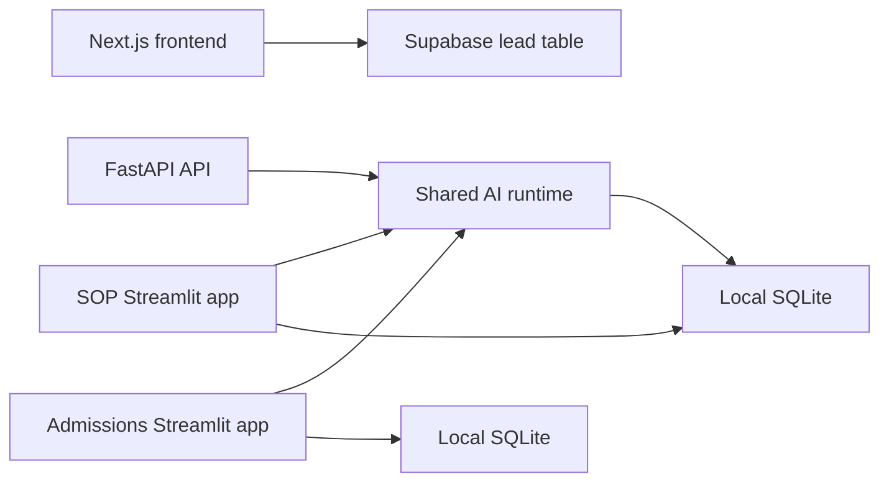

# Architecture

## Current state

The repository is a transitional monorepo:

- `apps/web`: Next.js App Router marketing frontend with Supabase-backed lead capture and a mock-only SOP page
- `apps/api`: FastAPI public API for health, SOP review, admissions prediction, and deterministic demo endpoints
- `services/sop_review`: Streamlit SOP review tool using DeepSeek through the shared AI runtime, local SQLite persistence, file uploads, and runtime logs
- `services/admissions`: Streamlit admissions predictor using DeepSeek through the shared AI runtime and local SQLite persistence
- `docs/MIGRATION_BLUEPRINT.md`: approved migration target and phase plan

The shared AI runtime, shared contracts, Next.js frontend, and first public FastAPI surface now exist. The API exposes live endpoints through the runtime and deterministic mock endpoints without provider calls. Production persistence and frontend API integration are still pending.

## Migration target

The migration blueprint targets:

- a Next.js frontend that preserves the current KlassFin visual theme
- a FastAPI backend as the only public backend entry point
- a shared AI runtime for provider clients, retries, response parsing/repair, logging, and redaction
- separate task-specific domain modules for SOP review and admissions prediction
- DeepSeek for real requests and mock providers for demo mode
- shared contracts, centralized persistence, stronger rate limiting, and explicit retention workflows

The frontend framework migration, API, contracts, and shared runtime parts of that target now exist; production persistence, retention, and frontend API wiring are still in progress.

## Data flow today

## Key constraints

- Preserve the current frontend theme during migration.
- Keep docs aligned to shipped behavior.
- Treat local SQLite databases, uploaded SOPs, and runtime logs as local-only artifacts that must never be committed.
