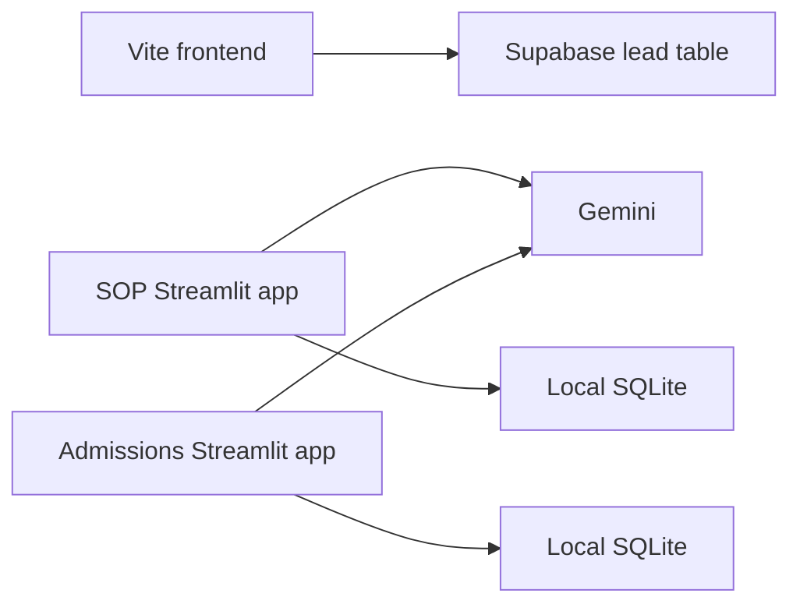

# Architecture

## Current state

The repository is a transitional monorepo:

- `apps/web`: Vite + React marketing frontend with Supabase-backed lead capture and a mock-only SOP page
- `services/sop_review`: Streamlit SOP review tool using Gemini, local SQLite persistence, file uploads, and runtime logs
- `services/admissions`: Streamlit admissions predictor using Gemini and local SQLite persistence
- `docs/MIGRATION_BLUEPRINT.md`: approved migration target and phase plan

There is no shared public API, no FastAPI app, no provider abstraction, and no unified mock/demo mode yet.

## Migration target

The migration blueprint targets:

- a Next.js frontend that preserves the current KlassFin visual theme
- a FastAPI backend as the only public backend entry point
- reusable domain packages for SOP review and admissions prediction
- a provider abstraction with DeepSeek for real requests and mock providers for demo mode
- shared contracts, centralized persistence, stronger rate limiting, and explicit retention workflows

Those target components are planned, not present in the current codebase.

## Data flow today

## Key constraints

- Preserve the current frontend theme during migration.
- Keep docs aligned to shipped behavior.
- Treat local SQLite databases, uploaded SOPs, and runtime logs as local-only artifacts that must never be committed.
