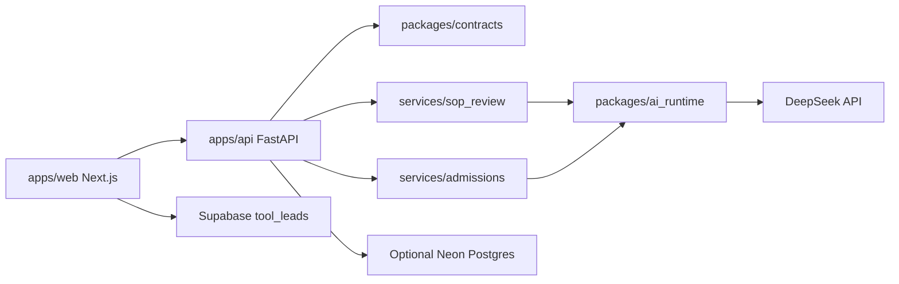

# Architecture

Study Abroad Platform is a public monorepo with a Next.js frontend, FastAPI backend, shared contracts, shared AI runtime, and two prompt-heavy Python domain services.

## Runtime shape

## Components

- `apps/web`: Next.js App Router frontend with the preserved KlassFin theme, marketing/content pages, EMI calculator, Supabase lead capture, and API-backed SOP Review and Admit Predictor tools.
- `apps/api`: FastAPI backend exposing `/health`, live SOP/admissions endpoints, deterministic mock endpoints, CORS, JSON/body-size guards, backend rate limits, safe errors, redacted request/error logs, and optional Postgres persistence.
- `services/sop_review`: reusable SOP review domain service plus an internal/local Streamlit adapter. It owns SOP validation, ingestion for the Streamlit app, prompts, grading schemas, and prompt regression tests.
- `services/admissions`: reusable admissions prediction domain service plus an internal/local Streamlit adapter. It owns profile validation, prompt construction, post-processing, repair behavior, schemas, and prompt regression tests.
- `packages/ai_runtime`: shared DeepSeek provider runtime, retry/timeout behavior, response normalization, JSON parsing helpers, and secret redaction.
- `packages/contracts`: canonical Pydantic API contracts, committed JSON Schemas, frontend TypeScript types, and deterministic mock payload examples.

## Request flows

Live SOP review:

1. User submits applicant details and pasted SOP text in `apps/web`.
2. Frontend posts to `POST /api/v1/sop/review`.
3. FastAPI validates shared contracts, request size, profile fields, and SOP limits.
4. Backend live rate limiting runs before any model call.
5. SOP domain service calls DeepSeek through `packages/ai_runtime`.
6. API returns a structured `SOPReviewResponse` and optionally persists a summarized record.

Live admissions prediction:

1. User submits a profile and one to five target programs.
2. Frontend posts to `POST /api/v1/admissions/predict`.
3. FastAPI validates shared contracts and domain-specific score ranges.
4. Backend live rate limiting runs before any model call.
5. Admissions service calls DeepSeek through `packages/ai_runtime`.
6. API returns a structured `AdmissionsPredictionResponse` and optionally persists a summarized record.

Mock/demo flows use `/api/v1/sop/review/mock` and `/api/v1/admissions/predict/mock`. They validate request shape and return deterministic contract-compliant payloads without calling DeepSeek or consuming live quotas.

## Data and persistence

- Frontend lead capture writes to Supabase from the browser.
- API persistence is optional locally and targets Neon Postgres in production.
- API migrations live in `apps/api/migrations` and run with `uv run python -m app.persistence.migrations`.
- API SOP persistence stores summary fields and structured grades, not raw SOP text or uploaded files.
- API admissions persistence stores profile summary fields and structured predictions, not full names or raw provider output.
- Postgres rate-limit buckets store salted hashes of anonymous identifiers, not raw IP addresses.
- Standalone Streamlit apps use local SQLite databases and should be treated as local-only sensitive artifacts.

## Contracts

`packages/contracts` is the frontend/backend boundary. Backend routes use the Pydantic models directly, JSON Schema snapshots make contract changes reviewable, and frontend TypeScript types mirror the same payloads. Mock and live responses share the same schema.

See `docs/contracts.md`.

## Current constraints

- FastAPI is the only intended public backend contract.
- DeepSeek keys remain backend-only.
- The public web SOP flow accepts pasted text only.
- Streamlit adapters remain intentionally retained internal/local tools, not public endpoints.
- Static content is code-owned for now.
- Exact retention windows and automated deletion jobs are pending.
- CI covers web, API, contracts, shared runtime, admissions, and SOP review checks.
